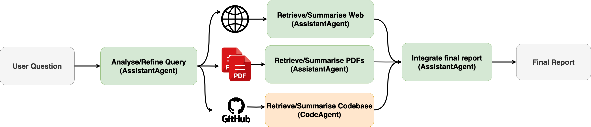

  

# CAPSML-ASSISTANT

An assistant designed to interactively answer questions about a project by retrieving, summarizing, and integrating information from PDFs, websites, and GitHub repositories. Built with LangGraph, LangChain, and Streamlit, it demonstrates how agentic workflows can be orchestrated using open-source LLMs (e.g., via Ollama).



---

## 🚀 Using the Project

### 📦 Installation

1. **Create and activate a Python 3.11.5 virtual environment**.
2. Clone the repository:
   ```bash
   git clone git@github.com:chirathyh/capsml-assistant.git
   cd capsml-assistant
   ```
3. Install required dependencies:
   ```bash
   pip install -r requirements.txt
   ```
4. Install [Ollama](https://ollama.com) and download your preferred open-source LLMs (e.g., `llama3.1:8b`, `codestral`, etc.):
   ```bash
   ollama pull llama3.1:8b
   ```
5. Create a `.env` file in the project root with:
   ```env
   SERPAPI_KEY=your-serpapi-key
   PDF_DIR=path-to-your-pdfs
   ```

---

### ▶️ Run the App

Launch the interactive UI with:

```bash
streamlit run app.py
```

---

## 🧠 How It Works

### ✳️ Architecture Overview

- **LangGraph**: A graph-based execution engine to manage a flow of AI tasks. Each node in the graph represents a function that operates on shared state. This allows for modular and dynamic control over logic like query analysis, retrieval, summarization, and integration.

- **LangChain**: Used to wrap and abstract interactions with LLMs, document loaders (e.g., `PyPDFLoader`), text splitters, vector stores (`FAISS`), and tools like web search (`SerpAPI`).

- **Ollama**: A local inference engine that runs LLMs on your machine. This project supports models like `llama3.1:8b`, `mistral`, `phi3`, and `codestral`.

- **FAISS**: Enables semantic search over embedded document chunks for fast and relevant retrieval.

- **Streamlit**: Provides an interactive UI where users can:

  - Input questions
  - Toggle use of PDFs, Web, or GitHub code
  - Choose the LLMs powering different agents

---

## 🔧 Components

- **Query Analysis**: Classifies the user query to determine if PDF, Web, or Code retrieval is needed.
- **Retrievers**:
  - **PDFs**: Loaded and chunked using LangChain’s `PyPDFLoader` and `CharacterTextSplitter`.
  - **Web**: Search and scrape using SerpAPI and BeautifulSoup.
  - **GitHub Code**: Clones repos, parses Markdown and source files for LLM summarization.
- **Summarization Agents**: LLMs (via Ollama) generate summaries and explanations for each modality.
- **Integration Node**: Merges summaries from all sources into a coherent report.
- **Memory Log**: Stores recent queries and outputs for context/reference.

---

## 📋 Features

- 🔀 Modular agent selection: Choose different LLMs for assistant and code summarization.
- 🧠 Graph-based orchestration of retrieval and summarization pipelines.
- 📎 Supports multi-modal knowledge extraction: PDFs, web content, and source code.
- ✅ Local, open-source LLMs — no need to send data to the cloud.
- 💽 Simple Streamlit UI for interaction.

---

## 🛠️ TODO

[ ]  Add a memory to the assistant. <br>
[ ]  Dynamically retrieve the list of available models from Ollama. <br>
[ ]  Dynamically search GitHub Repos. <br>
[ ]  Present the refined search query and web search results<br>

---

## 👥 Acknowledgements

This project uses and builds on:

- [LangGraph](https://github.com/langchain-ai/langgraph)
- [LangChain](https://www.langchain.com/)
- [Ollama](https://www.ollama.com/)
- [Streamlit](https://streamlit.io/)
- [FAISS](https://github.com/facebookresearch/faiss)

